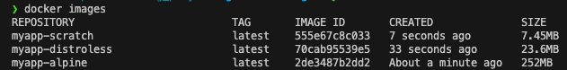

# Optimized Go Docker Images

This repository offers a streamlined alternative to Alpine images by utilizing Distroless or Scratch images to run Go applications in Docker. By leveraging the power of multi-stage builds, you can use multiple FROM statements in a single Dockerfile. Each FROM statement initiates a new build stage, allowing you to create more efficient and smaller Docker images by separating the build environment from the runtime environment.

The reduction in image size is remarkable! Check out the numbers in the screenshot below:



## Building and Running the Images

### Distroless Image

Uses `gcr.io/distroless/static-debian12` — a minimal image (~2 MiB) with no shell, package manager, or unnecessary libraries. Ideal for statically compiled Go binaries.

To build the Distroless image:
```bash
docker build -t myapp-distroless -f distroless.Dockerfile .
```

To run the Distroless image:
```bash
docker run -p 8181:8181 myapp-distroless
```

### Scratch Image

Uses `scratch` — an empty base image. The smallest possible image, containing only your binary plus timezone data and CA certificates for HTTPS support.

To build the Scratch image:
```bash
docker build -t myapp-scratch -f scratch.Dockerfile .
```

To run the Scratch image:
```bash
docker run -p 8181:8181 myapp-scratch
```


## Building Multi-Platform Docker Images

To build multi-platform Docker images, you can use Docker Buildx. Below are the commands to set up and use Buildx for building images for multiple platforms.

1. Create and use a new builder instance:
    ```sh
    docker buildx create --use --name mybuilder --driver docker-container
    ```

2. Inspect the builder instance and bootstrap it:
    ```sh
    docker buildx inspect mybuilder --bootstrap
    ```

3. Build the image for `linux/amd64` platform using the `scratch.Dockerfile`:
    ```sh
    docker buildx build --platform linux/amd64 -t myapp-scratch-amd64 -f scratch.Dockerfile --load .
    ```

4. Build the image for `linux/arm64` platform using the `scratch.Dockerfile`:
    ```sh
    docker buildx build --platform linux/arm64 -t myapp-scratch-arm64 -f scratch.Dockerfile --load .
    ```

5. Build the image for `linux/amd64` platform using the `distroless.Dockerfile`:
    ```sh
    docker buildx build --platform linux/amd64 -t myapp-distroless-amd64 -f distroless.Dockerfile --load .
    ```

6. Build the image for `linux/arm64` platform using the `distroless.Dockerfile`:
    ```sh
    docker buildx build --platform linux/arm64 -t myapp-distroless-arm64 -f distroless.Dockerfile --load .
    ```

**Note:** If you need to push the images, you can run:
```sh
docker buildx build --platform linux/amd64,linux/arm64 -t myapp-scratch -f scratch.Dockerfile --push .
```

## Security Features

- **Non-root execution**: Both images run as non-root users, limiting the impact of potential container breaches
- **Minimal attack surface**: No shell, package manager, or unnecessary libraries in the final image
- **Static compilation**: `CGO_ENABLED=0` produces a fully static binary with no runtime dependencies
- **Stripped binaries**: `-ldflags="-s -w"` removes debug symbols, reducing binary size
- **CA certificates**: Scratch image includes CA certificates for secure HTTPS connections
- **Pinned builder image**: Uses a specific Go version (`golang:1.26-bookworm`) instead of `latest` for reproducible builds

## Additional Information

- About Distroless Image:
Distroless images are a type of container image that includes only your application and its runtime dependencies, without any additional libraries, package managers, or shells that are typically found in standard Linux distributions. This approach results in significantly smaller and more secure images.
[GoogleContainerTools - Distroless](https://github.com/GoogleContainerTools/distroless)

- About Scratch Image:
Scratch images are minimal Docker images that contain only the essential components needed to run your application. They are essentially empty images, which means they don't include any operating system or additional libraries. This approach results in extremely small and efficient images.
[Docker Hub - Scratch](https://hub.docker.com/_/scratch)
